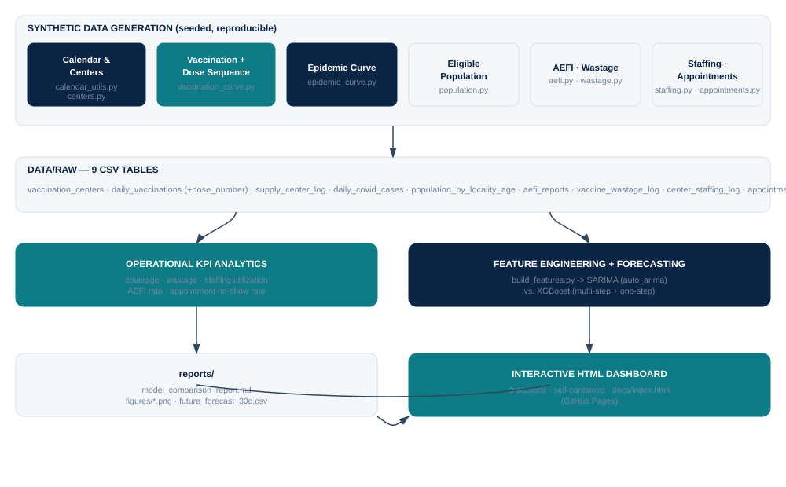
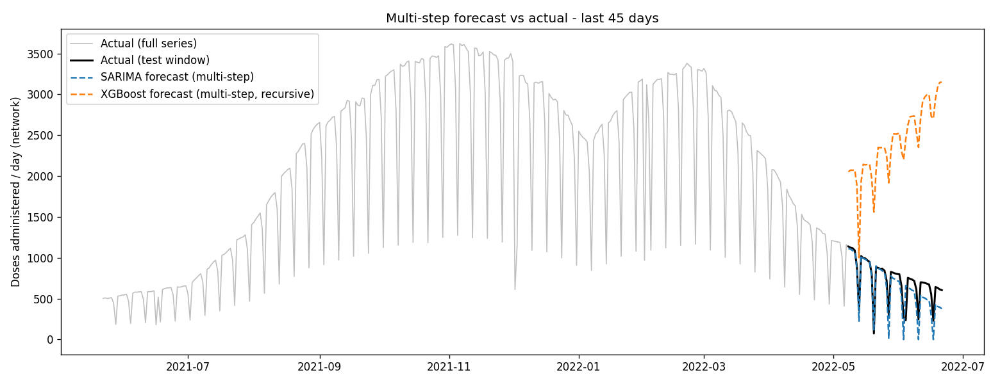
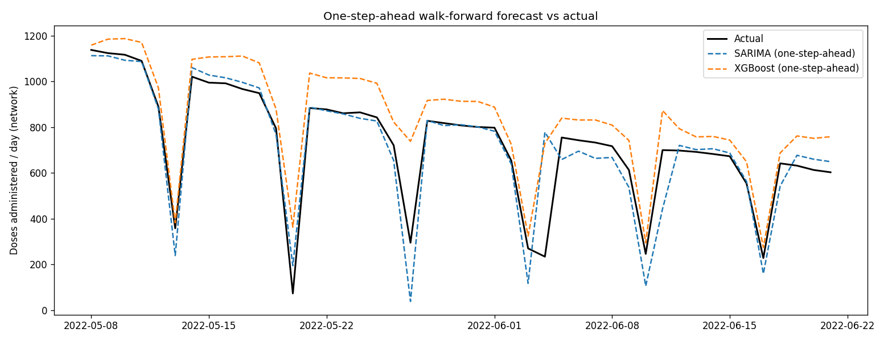
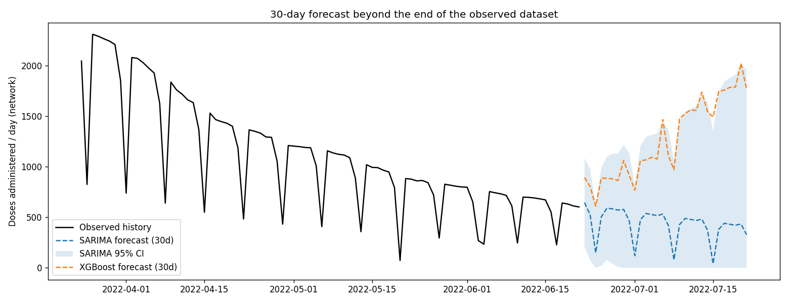
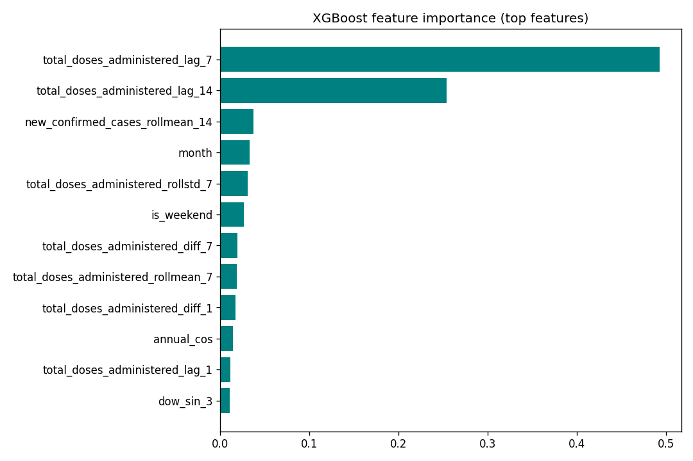
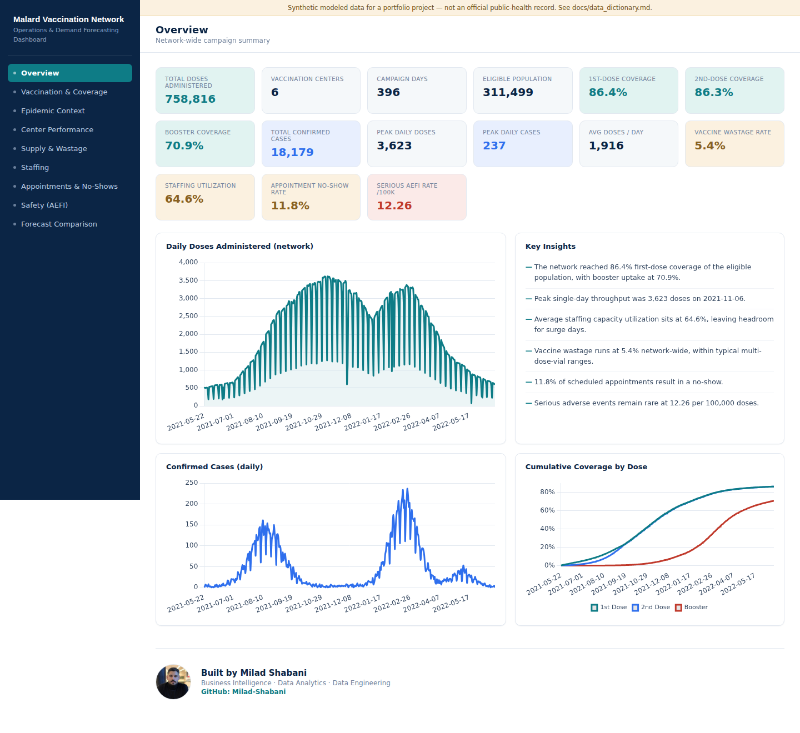

# COVID-19 Vaccination Analytics and Demand Forecasting
**COVID-19 vaccination operations analytics & demand forecasting for a district health network**, built on a synthetic dataset modeled after Malard County, Tehran Province, Iran (1 Khordad 1400 - 31 Khordad 1401 / 22 May 2021 - 21 Jun 2022).

[](https://github.com/Milad-Shabani/Covid-vaccination-demand-forecasting/actions)


> ⚠️ **This repository uses synthetic / modeled data.** It is a data-engineering and data-science portfolio project, not an official public-health record. See [Data provenance](#data-provenance) below.

---

## Why this project

A district health network runs five vaccination centers fed by one central supply/cold-chain site. Over a 13-month campaign, daily throughput swung from ~500 doses/day at launch to a ~3,500/day peak during the national push, back down to ~600/day as coverage saturated - all while two COVID-19 waves (Delta, then Omicron) reshaped demand along the way.

This project answers three practical questions a health-system analytics team would actually be asked:

1. **What happened?** - Clean, joinable, analysis-ready daily data across centers, vaccine products, and case counts.
2. **How good is "good enough" forecasting?** - A rigorous SARIMA vs. XGBoost comparison, evaluated two different ways (multi-step vs. one-step-ahead), because the honest answer to "which model is better" depends entirely on how you ask the question.
3. **What's next?** - A 30-day forward forecast beyond the observed data, with uncertainty bounds.

The headline result is more interesting than "model X wins" - see [§ Key finding](#key-finding-why-the-comparison-method-matters-more-than-the-model).

---

## Architecture

```mermaid
flowchart LR
    subgraph Generation["Synthetic Data Generation"]
        CAL[Jalali/Gregorian<br/>calendar_utils.py]
        VAX[Vaccination throughput<br/>+ dose sequence<br/>vaccination_curve.py]
        EPI[Epidemic curve<br/>epidemic_curve.py]
        CEN[Center metadata<br/>centers.py]
        POP[Eligible population<br/>population.py]
        AEFI[Adverse events<br/>aefi.py]
        WASTE[Vaccine wastage<br/>wastage.py]
        STAFF[Staffing<br/>staffing.py]
        APPT[Appointments<br/>appointments.py]
        CAL --> VAX
        CAL --> EPI
        CAL --> STAFF
        CEN --> VAX
        CEN --> POP
        VAX --> AEFI
        VAX --> WASTE
        VAX --> APPT
    end

    subgraph Raw["data/raw/"]
        R1[vaccination_centers.csv]
        R2[daily_vaccinations.csv<br/>+ dose_number]
        R3[supply_center_log.csv]
        R4[daily_covid_cases.csv]
        R5[population_by_locality_age.csv]
        R6[aefi_reports.csv]
        R7[vaccine_wastage_log.csv]
        R8[center_staffing_log.csv]
        R9[appointments_log.csv]
    end

    subgraph Analytics["Operational KPIs<br/>analytics/operational_kpis.py"]
        KPI[coverage · wastage · staffing<br/>AEFI rate · no-show rate]
    end

    subgraph Features["Feature Engineering"]
        FE[build_features.py<br/>calendar + lag + rolling features]
    end

    subgraph Models["Forecasting"]
        SARIMA[SARIMA<br/>pmdarima.auto_arima]
        XGB[XGBoost<br/>XGBRegressor]
    end

    subgraph Outputs["reports/ + dashboard"]
        REP[model_comparison_report.md]
        FIG[figures/*.png]
        FUT[future_forecast_30d.csv]
        DASH[Interactive HTML dashboard]
    end

    Generation --> Raw
    Raw --> Analytics --> DASH
    Raw --> FE --> Models --> Outputs
```



<details>
<summary>Mermaid source (renders natively on GitHub)</summary>



</details>

## Repository layout

```
covid-vaccination-demand-forecasting/
├── src/malard_vax/
│   ├── data_generation/     # calendar, centers, vaccination+dose-sequence, epidemic,
│   │                        # population, AEFI, wastage, staffing, appointments
│   ├── analytics/           # operational_kpis.py - coverage, wastage, staffing, AEFI, no-show KPIs
│   ├── features/            # daily feature-engineering pipeline
│   └── models/               # SARIMA, XGBoost, evaluation metrics
├── dashboard/                 # self-contained interactive HTML dashboard (build scripts + assets)
├── scripts/
│   ├── generate_sample_data.py     # produces data/raw/*.csv + data/processed/ KPIs
│   ├── run_forecast_pipeline.py    # trains/evaluates models, writes reports/
│   ├── build_dashboard.py          # builds dashboard/dist/index.html
│   ├── publish_to_github.sh        # commit + push (Linux/macOS)
│   └── publish.bat                 # commit + push via GitHub CLI (Windows)
├── data/raw/                 # generated synthetic source data (checked in for convenience)
├── data/processed/           # derived features + operational KPI tables
├── reports/                  # generated metrics, figures, and the comparison report
├── docs/                     # data dictionary + methodology write-up
├── tests/                    # pytest unit tests (30 tests)
└── .github/workflows/ci.yml  # regenerates data + forecasts + tests on every push
```

## Getting started

```bash
git clone https://github.com/Milad-Shabani/Covid-vaccination-demand-forecasting.git
cd covid-vaccination-demand-forecasting
pip install -r requirements.txt

# 1. Generate the synthetic dataset (deterministic, seeded)
python scripts/generate_sample_data.py

# 2. Run the full forecasting pipeline (SARIMA + XGBoost, both tasks, future forecast)
python scripts/run_forecast_pipeline.py

# 3. Build the interactive dashboard
python scripts/build_dashboard.py

# 4. Run the test suite
pytest tests/ -v
```

Or with `make`: `make install data forecast dashboard test`.

**Publishing to GitHub:** on Windows, double-click `scripts\publish.bat` **from inside the `scripts\` folder — do not copy or move it elsewhere** (it refuses to run if it can't verify it's in the right place, but don't rely on that: always run it in place). Requires [Git](https://git-scm.com/) on PATH and an authenticated GitHub credential. On Linux/macOS, run `./scripts/publish_to_github.sh https://github.com/Milad-Shabani/Covid-vaccination-demand-forecasting.git`. Both scripts commit everything and push to `main`, automatically pulling/rebasing first if the remote has commits you don't have locally.

Outputs land in `reports/model_comparison_report.md`, `reports/figures/*.png`, and `data/processed/future_forecast_30d.csv`.

---

## Results

### Multi-step forecast (45-day held-out test window, no peeking)

| model | MAE | RMSE | MAPE % | sMAPE % | R² |
|---|---:|---:|---:|---:|---:|
| **SARIMA** | **116.3** | **153.8** | **26.8** | **35.2** | **0.632** |
| XGBoost (recursive) | 1679.6 | 1757.0 | 329.5 | 108.1 | -46.99 |



### One-step-ahead walk-forward forecast (same window, fresh history every day)

| model | MAE | RMSE | MAPE % | sMAPE % | R² |
|---|---:|---:|---:|---:|---:|
| SARIMA | 60.8 | 111.6 | 18.8 | 17.3 | **0.807** |
| XGBoost | 118.7 | 148.1 | 29.6 | 19.0 | 0.659 |



### 30-day forecast beyond the end of the observed dataset



### Key finding: why the comparison method matters more than the model

One-step-ahead, SARIMA and XGBoost are both solid (R² 0.81 vs. 0.66). Asked to forecast the same 45 days **without** daily feedback, SARIMA's error moves up but stays usable (R² 0.63), while **XGBoost's error explodes by nearly two orders of magnitude** (R² -46.99) and the forecast diverges wildly instead of tracking the observed pattern.

The feature-importance chart explains why: XGBoost leans almost entirely on `lag_7`/`lag_14` of the target itself.



In a *recursive* multi-step forecast, those lag features are eventually filled with the model's **own predictions** rather than ground truth - and because tree ensembles cannot extrapolate a trend beyond the value range seen during training, once the recursive predictions drift even slightly high there is no mechanism to correct course. SARIMA, whose differencing terms encode trend directly, extrapolates the decline naturally.

**Practical takeaway:** for a trend-driven operational series like this one, classical SARIMA (or a hybrid that lets a tree model correct SARIMA's *residuals* rather than predict the raw level) is the safer choice for multi-week-ahead planning; XGBoost earns its keep when it is re-run daily with fresh actuals, or given genuinely forward-looking exogenous features. This is a real, common pitfall in applied forecasting - not an artifact of this dataset - and is discussed in full, with all four model/task combinations, in [`reports/model_comparison_report.md`](reports/model_comparison_report.md).

---

## Operational KPIs (new)

Beyond throughput forecasting, five new synthetic data sources power a broader operations picture - dose-sequence coverage, vaccine wastage, staffing utilization, adverse-event monitoring, and appointment no-shows. See [`docs/data_dictionary.md`](docs/data_dictionary.md) for schemas and [`docs/methodology.md`](docs/methodology.md) §6 for how each is generated.

| KPI | Value |
|---|---:|
| 1st-dose coverage (end of window) | 86.4% |
| 2nd-dose coverage | 86.4% |
| Booster coverage | 70.9% |
| Network-wide vaccine wastage rate | 5.4% |
| Avg. staffing capacity utilization | 64.6% |
| AEFI rate (serious, per 100k doses) | 12.3 |
| Avg. appointment no-show rate | 11.7% |

Coverage by dose is **pool-constrained**: cumulative 2nd-dose recipients can never exceed cumulative 1st-dose recipients, and boosters can never exceed 2nd-dose completions - enforced in generation and checked directly in `tests/test_new_data_sources.py`.

## Dashboard

A single self-contained HTML file (`dashboard/dist/index.html`) with a clean, clinical white-and-teal design - built with the same self-contained approach as the rest of this project (Chart.js inlined, no external runtime dependency). Nine sections: Overview, Vaccination & Dose Coverage, Epidemic Context, Center Performance, Supply & Wastage, Staffing, Appointments & No-Shows, Safety (AEFI), and Forecast Comparison.



**Full preview of all 9 sections:** [`docs/dashboard_preview.md`](docs/dashboard_preview.md)

Open it directly in any browser, or build it fresh with `python scripts/build_dashboard.py`.

---

## Data provenance

This project ships **synthetic** data:

- **Vaccination throughput** follows the operational shape specified for the project (500 → 3,500 → 600 doses/day across the window), simulated with realistic weekly seasonality (Friday is the Iranian weekend), autocorrelated day-to-day noise, and occasional shortage days. Each dose additionally carries a **dose_number** (1st/2nd/Booster), allocated with a pool constraint so coverage curves are internally consistent (see §6 of `docs/methodology.md`).
- **Confirmed-case counts** are **modeled**, not sourced from an official county-level registry (a granular, machine-readable, daily county dataset for this period is not publicly available). The curve is anchored to the **documented, published national epidemic timeline for Iran** - the Delta-driven fifth wave (peaked mid-August 2021) and the Omicron-driven sixth wave (accelerated through January-February 2022) - scaled to a plausible county population. Full sourcing is in [`docs/data_dictionary.md`](docs/data_dictionary.md).
- **Eligible population, AEFI reports, vaccine wastage, staffing, and appointments** are new synthetic tables (this update) - illustrative and seeded, **not** drawn from any real registry, pharmacovigilance system, or scheduling system. Rates (wastage %, AEFI %, no-show %) are loosely anchored to published typical ranges for context, not fit to real data. Full detail in [`docs/data_dictionary.md`](docs/data_dictionary.md).

Nothing here should be cited as an official statistic. See [`docs/methodology.md`](docs/methodology.md) for the full generation and modeling methodology.

## Possible extensions

- ~~Per-center forecasting~~ / ~~a dashboard~~ - **done in this update** (see [Dashboard](#dashboard) above; per-center breakdowns are in the Center Performance dashboard section, though the SARIMA/XGBoost models themselves remain network-level).
- Model the target's first difference (or SARIMA residuals) with XGBoost instead of the raw level, to fix the multi-step extrapolation failure documented above.
- Feed `appointments_scheduled` (genuinely forward-looking, unlike every other XGBoost feature today) into `build_features.py` as an exogenous regressor - a natural next step now that the appointments data exists.
- Prophet / TBATS as a third baseline, and a formal backtesting harness with rolling-origin cross-validation instead of a single train/test split.

## License

MIT - see [LICENSE](LICENSE).
