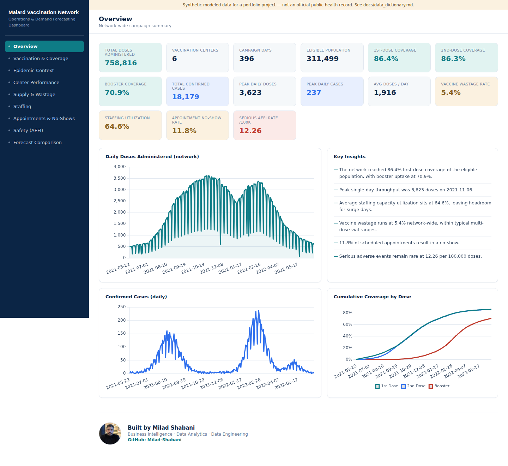
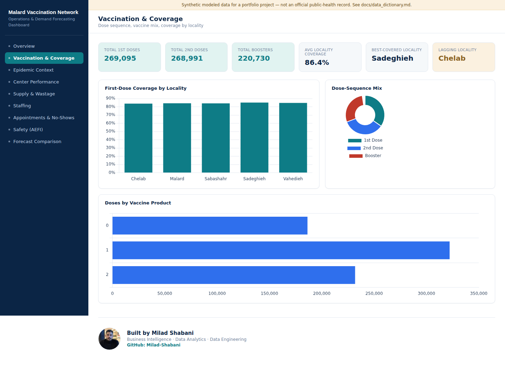
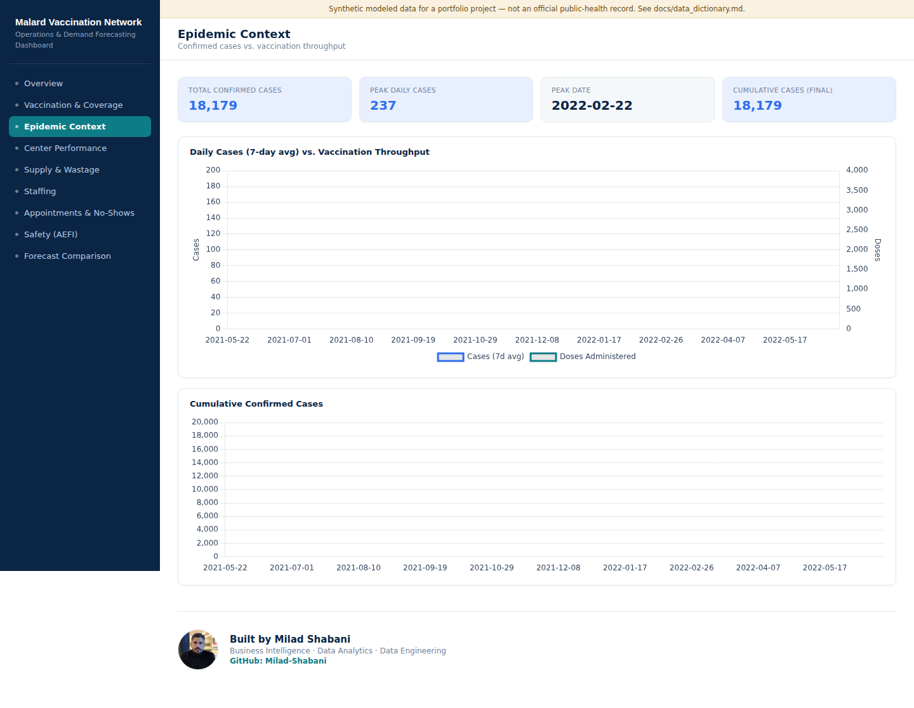
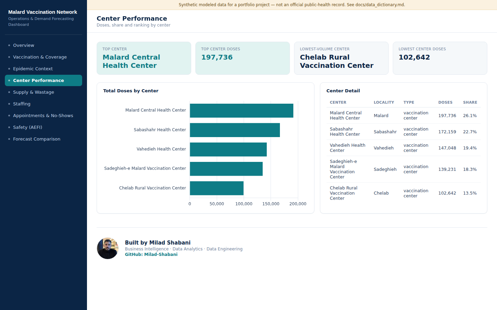
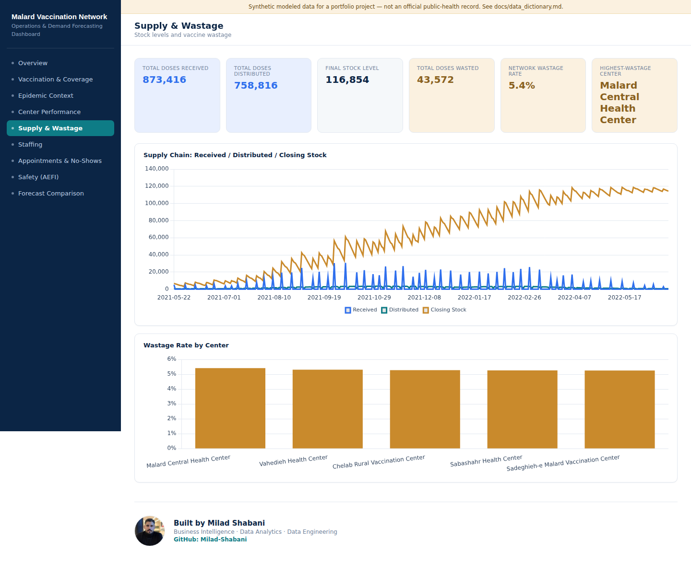
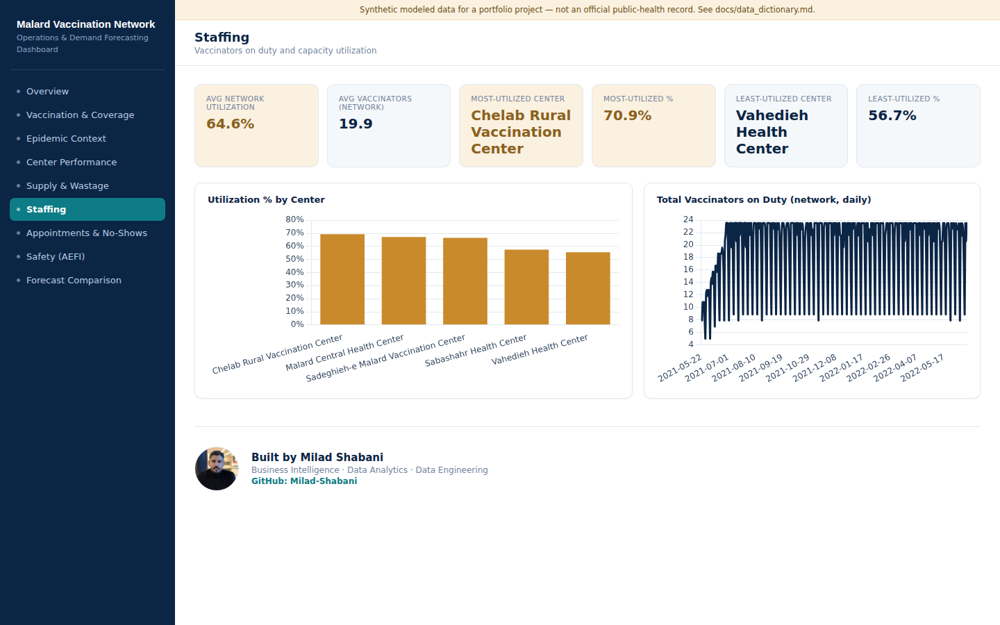
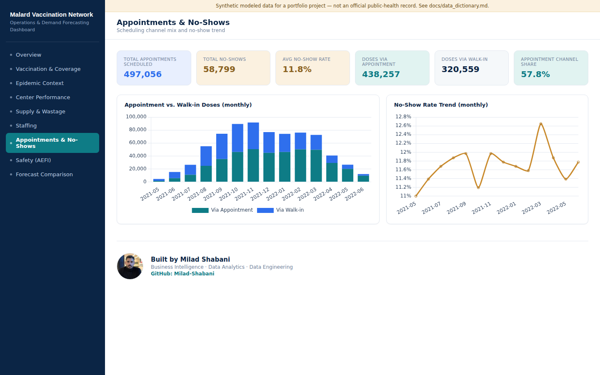
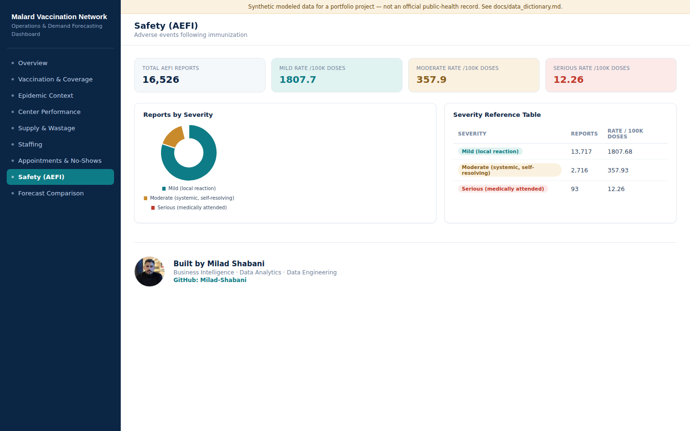
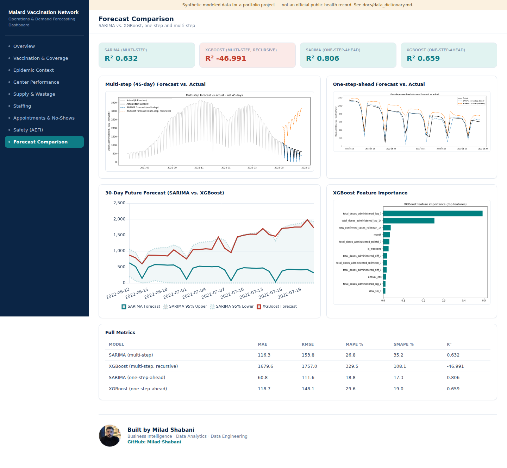

# Dashboard Preview — All Sections

Full-page screenshots of every section of the interactive dashboard
(`dashboard/dist/index.html`, also published at `docs/index.html` for
GitHub Pages). All numbers come from the synthetic dataset described in
[`data_dictionary.md`](data_dictionary.md); see [`methodology.md`](methodology.md)
for how each is generated, and the disclaimer banner on the dashboard
itself — this is modeled/synthetic data, not an official public-health
record.

## 1. Overview

## 2. Vaccination & Coverage

## 3. Epidemic Context

## 4. Center Performance

## 5. Supply & Wastage

## 6. Staffing

## 7. Appointments & No-Shows

## 8. Safety (AEFI)

## 9. Forecast Comparison

